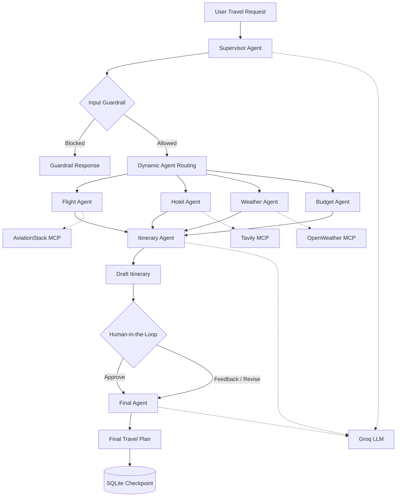

# TripMate AI — End-to-End Multi-Agent Travel Planning System

> **A production-style multi-agent AI system that turns a natural-language travel request into a budget-aware, weather-aware itinerary — with dynamic agent routing and human approval before finalization.**

[](https://www.python.org/)
[](https://www.langchain.com/langgraph)
[](https://fastapi.tiangolo.com/)
[](https://modelcontextprotocol.io/)
[](https://www.sqlite.org/)

## 🎯 What problem does it solve?

Most AI travel assistants behave like a single chatbot: one prompt goes in, one model generates everything out.

**TripMate AI takes a different approach.**

It uses a **supervisor-driven multi-agent workflow** where the system first understands the request, decides which specialists are actually needed, gathers information through external tools, builds a draft itinerary, and pauses for **human approval** before producing the final answer.

Example:

> "Plan a 7-day Japan trip from Bangladesh under ₹2 lakh with flights, hotels, sightseeing and weather considerations."

Instead of blindly calling every tool, the supervisor can route the request through:

`Flight Agent → Hotel Agent → Weather Agent → Budget Agent → Itinerary Agent → Human Review → Final Agent`

For a smaller request, unnecessary specialists can be skipped.

---

## 🧠 Architecture



---

## 🚀 Key Features

### 1. Dynamic Multi-Agent Routing

The supervisor analyzes the user's request and selects only the relevant specialist agents.

Available agents:

- ✈️ **Flight Agent** — airports, airlines, routes and flight guidance
- 🏨 **Hotel Agent** — accommodation and hotel research
- 🌤️ **Weather Agent** — current weather and forecast
- 💰 **Budget Agent** — cost analysis, feasibility and savings
- 🗺️ **Itinerary Agent** — combines the specialist outputs
- 🧑‍⚖️ **Human Approval Agent** — pauses the workflow for review
- ✨ **Final Agent** — produces the polished final response

### 2. Input Guardrail

Before routing, a dedicated guardrail checks whether the request is actually related to travel planning.

Clearly unrelated or harmful requests can be blocked before the specialist workflow runs.

### 3. MCP-Based Tool Integration

The system uses the **Model Context Protocol (MCP)** to connect agents with external tools.

Current integrations include:

- **Tavily MCP** → web research / hotel information
- **AviationStack MCP** → airport and airline information
- **Custom OpenWeather MCP server** → current weather + forecast
- **Groq** → LLM reasoning and generation

### 4. Human-in-the-Loop

The itinerary is **not immediately finalized**.

The workflow pauses after generating a draft:

```text
Generate Draft
      ↓
Human Review
      ↓
 ┌────┴─────┐
Approve    Revise
   ↓          ↓
 Final Agent ←┘
```

The user can approve the plan or provide revision feedback.

### 5. Persistent Graph State

LangGraph state is persisted using **SQLite checkpointing**, allowing the workflow to maintain state across the approval/revision cycle.

### 6. Graceful Tool Failure

External APIs can fail.

Instead of crashing the whole workflow, individual agents have fallback behavior and clearly label unavailable live information.

### 7. Web UI + PDF Export

The project includes a FastAPI-powered frontend with:

- Natural-language travel input
- Agent execution visualization
- Supervisor reasoning
- Human approval interface
- Markdown-rendered final itinerary
- Copy-to-clipboard
- PDF export

---

## 🛠️ Tech Stack

| Layer               | Technology                      |
| ------------------- | ------------------------------- |
| LLM                 | Groq / `openai/gpt-oss-120b`    |
| Agent Orchestration | LangGraph                       |
| LLM Framework       | LangChain                       |
| Tool Protocol       | MCP                             |
| Backend             | FastAPI                         |
| Persistence         | SQLite + LangGraph Checkpointer |
| Web Search          | Tavily                          |
| Flight Data         | AviationStack                   |
| Weather             | OpenWeather                     |
| Frontend            | HTML, CSS, JavaScript           |
| Server              | Uvicorn                         |
| Containerization    | Docker                          |

---

## 📂 Project Structure

```text
End-to-End-Multi-Agent-AI-System/
│
├── app.py
├── backend.py
├── mcp_client.py
├── custom_weather_api.py
├── template.py
│
├── tools/
│   ├── __init__.py
│   ├── flight_tool.py
│   └── tavily_tool.py
│
├── templates/
│   └── index.html
│
├── static/
│   ├── script.js
│   └── style.css
│
├── requirements.txt
├── Dockerfile
└── README.md
```

---

## ⚙️ How the workflow works

### Step 1 — User Request

The user provides a natural-language travel request.

```text
Plan a 7 day Japan trip from Bangladesh under ₹2 lakh,
including flights, hotels, weather and sightseeing.
```

### Step 2 — Guardrail

The supervisor checks whether the request is appropriate for the travel domain.

### Step 3 — Supervisor Planning

The supervisor extracts constraints such as:

```json
{
  "destination": "Japan",
  "origin": "India",
  "duration": "7 days",
  "budget": "₹2 lakh"
}
```

It then chooses the relevant agents.

### Step 4 — Specialist Execution

Each selected specialist handles one responsibility.

This avoids forcing one LLM call to simultaneously solve flights, accommodation, weather and budgeting.

### Step 5 — Itinerary Generation

The itinerary agent combines the available specialist outputs into a practical draft.

### Step 6 — Human Review

The workflow pauses and asks the user:

> Do you approve this itinerary?

The user can either approve it or provide feedback.

### Step 7 — Finalization

The final agent incorporates the approval/revision decision and generates the polished travel plan.

---

## 🔐 Environment Variables

Create a `.env` file in the project root:

```env
GROQ_API_KEY=your_groq_key
TAVILY_API_KEY=your_tavily_key
AVIATION_STACK_API_KEY=your_aviationstack_key
OPENWEATHER_API_KEY=your_openweather_key

# Optional
GROQ_MODEL=openai/gpt-oss-120b
SQLITE_DB_PATH=checkpoints.db
```

**Never commit `.env` or API keys to GitHub.**

---

## ▶️ Run Locally

### 1. Clone the repository

```bash
git clone <your-repository-url>
cd End-to-End-Multi-Agent-AI-System
```

### 2. Create a virtual environment

```bash
python -m venv .venv
```

Windows:

```bash
.venv\Scripts\activate
```

### 3. Install dependencies

```bash
pip install -r requirements.txt
```

### 4. Configure environment variables

Create `.env` using the variables shown above.

### 5. Start the application

```bash
uvicorn app:app --reload
```

Then open:

```text
http://127.0.0.1:8000
```

---

## 🐳 Docker

Build:

```bash
docker build -t tripmate-ai .
```

Run:

```bash
docker run --env-file .env -p 8000:8000 tripmate-ai
```

---

## 🧪 Example Prompts

```text
Plan a 7 day Japan trip from Bangladesh under ₹2 lakh.
```

```text
Plan a 5 day Dubai trip with hotels and sightseeing.
```

```text
What is the weather like in Tokyo and what should I pack?
```

```text
Find flight information from Dhaka to Tokyo.
```

The supervisor should adapt the workflow based on what the request actually needs.

---

## 💡 Engineering Decisions

### Why LangGraph?

The workflow contains branching, state, persistence and human interruption. A graph-based orchestration model fits this better than a simple sequential chain.

### Why a Supervisor?

A single monolithic agent becomes harder to control as responsibilities grow.

The supervisor creates a separation between:

**planning → specialist execution → synthesis → human review → finalization**

### Why MCP?

MCP provides a standardized interface between the AI workflow and external tools, making individual integrations easier to replace or extend.

### Why Human-in-the-Loop?

Generated travel plans can contain assumptions or outdated information. The approval checkpoint creates an explicit opportunity for the user to review and correct the draft before finalization.

### Why SQLite?

For a local project, SQLite provides lightweight persistent checkpoint storage without introducing a separate database service.

---

## ⚠️ Limitations

This is a portfolio/research project rather than a production booking platform.

- Flight information does not guarantee ticket availability or final ticket price.
- Hotel information depends on external search results.
- Weather forecasts can change.
- LLM-generated recommendations can contain errors.
- API failures can cause agents to fall back to non-live guidance.
- The system does not directly purchase flights or hotels.

Always verify important travel information with official providers before booking.

---

## 🔮 Future Improvements

- Parallel execution of independent specialist agents
- Real-time flight price comparison
- Hotel price/availability APIs
- Visa requirement agent
- Currency conversion agent
- Restaurant recommendation agent
- User preference memory
- Agent-level evaluation and tracing
- Cost / latency tracking per agent
- Redis or PostgreSQL-backed production checkpointing
- Authentication and multi-user sessions
- Streaming agent events to the frontend
- Automated itinerary regeneration when external conditions change

---

## 📌 Why this project matters

The goal was not simply to build another chatbot.

The project explores how an AI application can be designed as a **stateful, tool-using, multi-agent system** with:

- Dynamic routing
- Guardrails
- External tool integration
- Persistent state
- Human oversight
- Failure handling
- Final response synthesis

That architecture is closer to how complex AI workflows can be structured than a single `prompt → LLM → response` application.

---

## 👨‍💻 Author

**Arnab**

AI/ML • GenAI • Deep Learning • Backend

GitHub: `github.com/Mearnab01`

---

## ⭐ If you found this project useful

Star the repository and feel free to open an issue with feedback or ideas.
